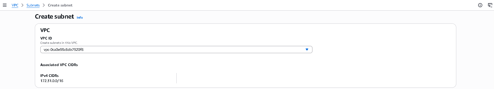
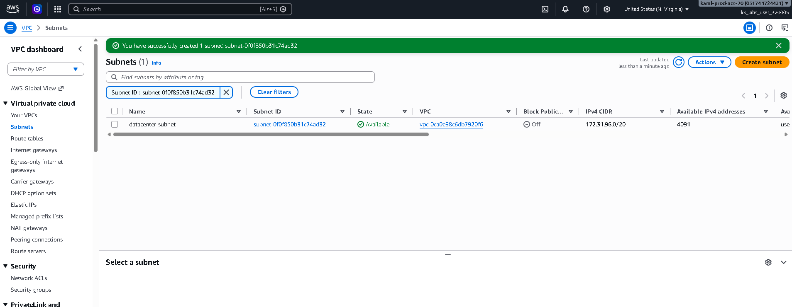

# Day 3: Create Subnet

## 100 Days of Cloud (AWS)

**Lab 3 | Day 3**

## Objective

Create a subnet named `datacenter-subnet` under the default Amazon VPC.

## Task Requirements

The Nautilus DevOps team is gradually migrating part of their infrastructure to AWS. As part of this migration, create one subnet with the following requirement:

- **Subnet name:** `datacenter-subnet`
- **VPC:** Default VPC

## AWS Management Console Solution

1. Sign in to the AWS Management Console.
2. Open the **VPC** service.
3. In the left navigation pane, select **Subnets**.
4. Click **Create subnet**.
5. Select the **default VPC**.
6. Configure the subnet details:
   - **Subnet name:** `datacenter-subnet`
   - Choose an Availability Zone as required by the lab environment.
   - Enter an IPv4 CIDR block that is valid within the default VPC CIDR range and does not overlap with existing subnets.
7. Click **Create subnet**.
8. Return to the **Subnets** page and verify that `datacenter-subnet` is listed and its state is **Available**.

## Verification

The subnet was successfully created and verified in the AWS VPC console.

- **Name:** `datacenter-subnet`
- **State:** Available
- **VPC:** Default VPC

## Screenshots

### 1. Default VPC Selected



### 2. Subnet Created Successfully



## AWS CLI Alternative

> Replace the placeholder values with the default VPC ID, Availability Zone, and an available non-overlapping CIDR block from your AWS account.

```bash
aws ec2 create-subnet \
  --vpc-id <default-vpc-id> \
  --cidr-block <subnet-cidr-block> \
  --availability-zone <availability-zone> \
  --tag-specifications 'ResourceType=subnet,Tags=[{Key=Name,Value=datacenter-subnet}]'
```

## Best Practices

- Choose a CIDR range that does not overlap with existing subnets.
- Plan subnet sizes according to future capacity requirements.
- Use meaningful resource names and tags.
- Design subnets across multiple Availability Zones for highly available production workloads.

## Conclusion

The `datacenter-subnet` subnet was successfully created under the default VPC and verified as available. This lab provided hands-on experience with AWS VPC networking and subnet creation.
